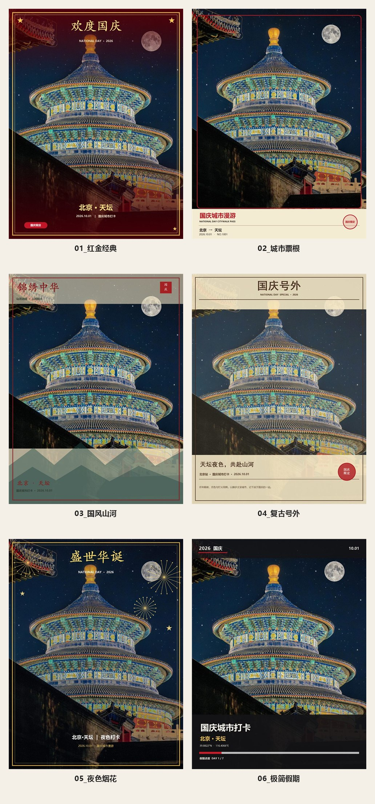

# 国庆城市打卡模板 Skill

一套可直接复用的国庆城市打卡模板 Skill。输入一张旅行照片，即可生成 6 款不同视觉风格的高清模板和预览图。



## 六款模板

1. 红金经典：正式、喜庆、节庆氛围最强。
2. 城市票根：旅行记录、城市漫游、纪念票根。
3. 国风山河：国风、诗意，适合古建和山水照片。
4. 复古号外：纪念刊、文化感、复古印刷。
5. 夜色烟花：夜景、浪漫、烟花氛围。
6. 极简假期：现代、克制、信息清楚，适合 App 原生模板。

## 仓库结构

```text
SKILL.md
PROMPT.md
scripts/
  generate_templates.ps1
  make_previews.ps1
references/
  design-spec.md
examples/
  00_六款合集预览.jpg
```

## 安装到 Codex

将仓库克隆到 Codex 的 skills 目录，并确保目录名为 `guoqing-city-checkin-templates`：

```powershell
$skillsDir = "$HOME\Documents\Codex\.agents\skills"
New-Item -ItemType Directory -Force -Path $skillsDir | Out-Null

git clone https://github.com/zhangxiansheng0011/National-day-skill.git `
  "$skillsDir\guoqing-city-checkin-templates"
```

如果已经克隆到其他位置，也可以直接复制整个目录。

## 使用方法

在对话中提供照片，并说明城市、地标和日期，例如：

```text
使用 guoqing-city-checkin-templates，为这张天坛照片生成国庆城市打卡模板。
城市：北京
地标：天坛
日期：2026.10.01
坐标：39.8822°N · 116.4066°E
```

Skill 会读取 `SKILL.md`，调用 `scripts/generate_templates.ps1` 生成 6 张高清 PNG，再调用 `scripts/make_previews.ps1` 生成 JPG 预览和 2×3 合集图。

## 手动运行

```powershell
$skillDir = "$HOME\Documents\Codex\.agents\skills\guoqing-city-checkin-templates"
$outputDir = "$HOME\Desktop\guoqing_templates"

& "$skillDir\scripts\generate_templates.ps1" `
  -ImagePath "$HOME\Desktop\天坛.jpg" `
  -City "北京" `
  -Landmark "天坛" `
  -Date "2026.10.01" `
  -Coordinates "39.8822°N · 116.4066°E" `
  -Theme "国庆城市打卡" `
  -DayProgress "DAY 1 / 7" `
  -OutputDir $outputDir

& "$skillDir\scripts\make_previews.ps1" -OutputDir $outputDir
```

另一个不依赖 Windows 脚本的版本见 `PROMPT.md`，可复制给支持图片设计和代码执行的 Agent。

## 兼容性

- 脚本依赖 Windows `System.Drawing`，支持 Windows PowerShell 5.1 和 PowerShell 7+。
- `.ps1` 文件使用 UTF-8 BOM，以兼容 Windows PowerShell 5.1 的中文解析。
- 原图不会被修改。
- 默认不裁切原图，并尽量避免文字遮挡照片主体。
- 不使用国旗、国徽、天安门、领导人或未经授权的官方标志。